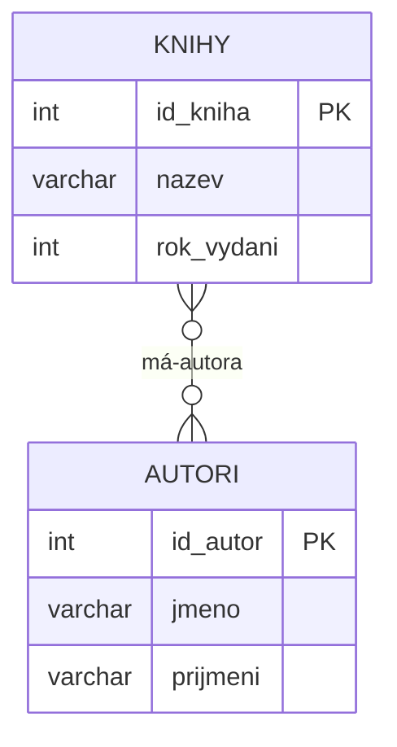
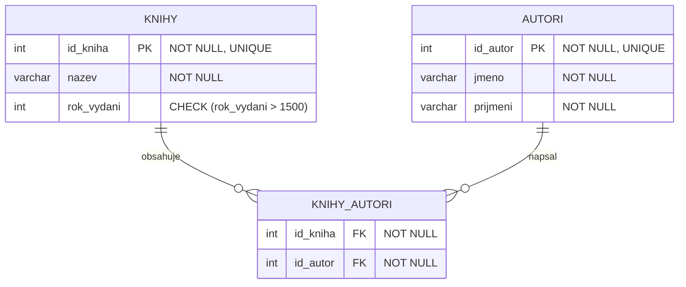
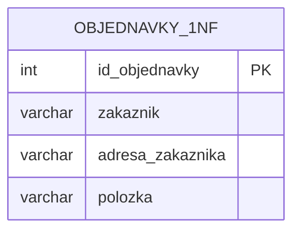
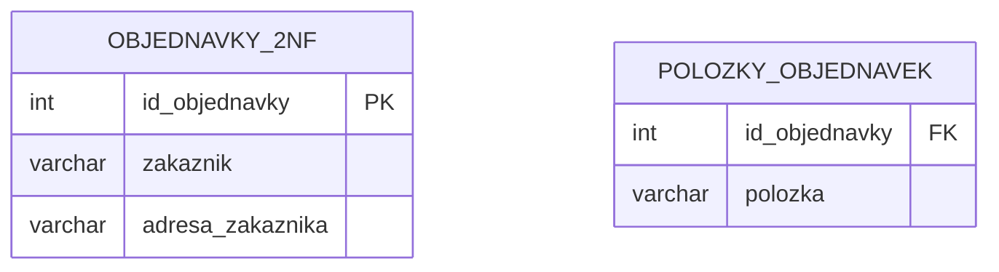
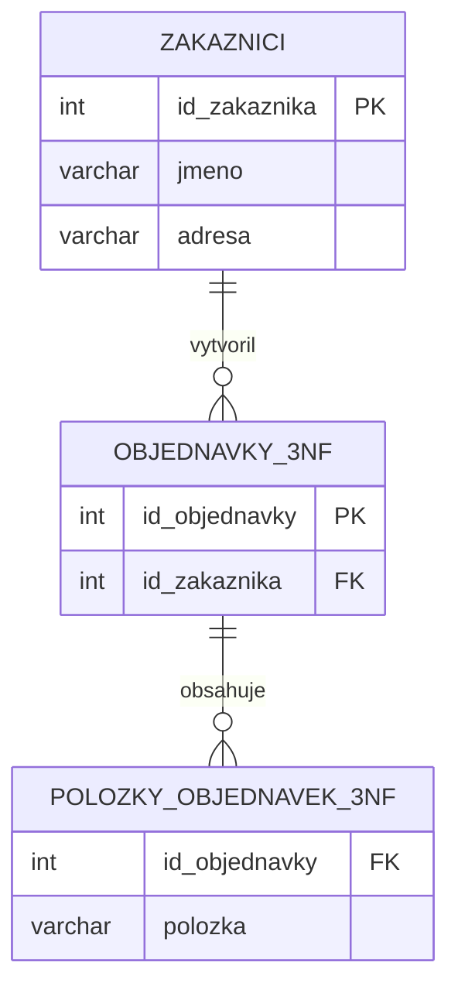
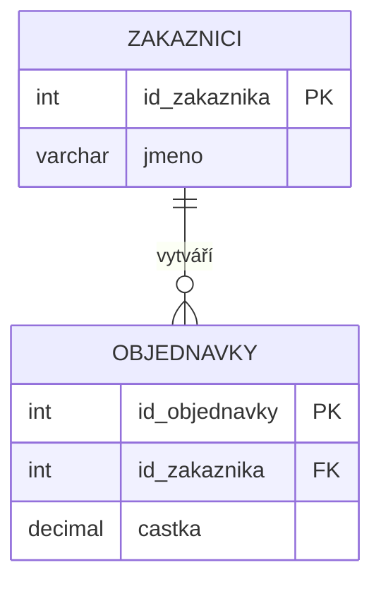

# Ukázkové řešení testu z Databázových systémů

## 1. DBS (Databázové systémy), klient-server

### Popis činností a architektury:
- **Databázový systém** = software pro správu dat (ukládání, vyhledávání, aktualizace)
- **Klient-server architektura** = oddělení databázových služeb od klientských aplikací

![[Image1DS.png]]

### Činnost klient-server architektury:
1. **Klient** posílá požadavky (SQL dotazy)
2. **Server** zpracuje požadavky a vrací výsledky
3. Veškerá data zůstávají na serveru
4. Klient nemá přímý přístup k fyzickým datům

### Typy databázových systémů:
- **Flat** (CSV soubory)
- **Síťová** (uzly grafu)
- **Hierarchická** (stromová struktura)
- **Objektová** (objekty s vlastnostmi)
- **Relační** (tabulky s vazbami) - nejpoužívanější

---

## 2. Slovní zadání - Evidence knih a autorů
V testu bude dané nějaké zadání

**Zadání:** *Navrhněte databázi pro evidenci knih a jejich autorů. Kniha může mít více autorů a autor může napsat více knih.*

### Logické schéma (ER diagram):



### Relační schéma s integritními omezeními:



---

## 3. Normalizace (1. NF až 3. NF)

### Definice normálních forem:
- **1. NF**: Atomické hodnoty + primární klíč
- **2. NF**: Plná závislost na celém PK (řeší složené klíče)
- **3. NF**: Eliminace tranzitivních závislostí

### Příklad nenormalizované tabulky:

| id_objednavky | zakaznik      | adresa_zakaznika | polozky      |
| ------------- | ------------- | ---------------- | ------------ |
| 1             | Jan Novák     | Praha 1          | Kniha, Tužka |
| 2             | Eva Svobodová | Brno 2           | Sešit        |

### Normalizace do 1. NF:

*Rozdělení neatomických hodnot na jednotlivé položky*

### Normalizace do 2. NF:

*Oddělení částečně závislých atributů*

### Normalizace do 3. NF:

*Eliminace tranzitivní závislosti (adresa → zákazník → objednávka)*

---

## 4. Integritní omezení

### Entitní integrita:
- **Primární klíč** musí být UNIQUE a NOT NULL
- Zajišťuje jednoznačnou identifikaci každého záznamu
- *Příklad:* `id_kniha INT PRIMARY KEY`

### Referenční integrita:
- **Cizí klíč** musí odkazovat na existující primární klíč
- Zabránění "sirotkům" v podřízených tabulkách
- Možnosti při mazání: NO ACTION, CASCADE, SET NULL, SET DEFAULT

### Doménová integrita:
- Omezení hodnot atributů:
  - Datový typ (`INT`, `VARCHAR`, `DATE`)
  - NOT NULL / NULL
  - UNIQUE
  - CHECK podmínky
  - Rozsah hodnot

---

## 5. SQL - DDL a DML syntaxe

- **DDL** - (Data Definition Language) – definuje strukturu db. `CREATE, ALTER, DROP`
- **DML** - (Data Manipulation Language) – manipulace s daty v db. `SELECT, INSERT, UPDATE, DELETE`

### Kompletní SELECT syntaxe:
```sql
SELECT [DISTINCT | ALL] sloupec1, sloupec2, ...
FROM tabulka1
[INNER | LEFT | RIGHT | FULL JOIN tabulka2 ON podminka]
[WHERE podminka]
[GROUP BY sloupec1, sloupec2, ...]
[HAVING podminka]
[ORDER BY sloupec1 [ASC | DESC], ...]
[LIMIT pocet];
```

### Vysvětlení klauzulí:
- **SELECT**: Výběr sloupců (mohou obsahovat agregační funkce)
- **FROM**: Určení zdrojové tabulky
- **JOIN**: Spojení tabulek podle zadané podmínky
- **WHERE**: Filtrace řádků před agregací
- **GROUP BY**: Seskupení řádků pro agregační funkce
- **HAVING**: Filtrace skupin po agregaci
- **ORDER BY**: Řazení výsledků
- **LIMIT**: Omezení počtu vrácených řádků

---

## 6. Příklady - JOINy a agregační funkce
V testu bude dané nějaké zadání

### A) Využití všech typů JOINů:



**INNER JOIN** - pouze zákazníci s objednávkami:
```sql
SELECT z.jmeno, o.castka
FROM zakaznici z
INNER JOIN objednavky o ON z.id_zakaznika = o.id_zakaznika;
```

**LEFT JOIN** - všichni zákazníci (i bez objednávek):
```sql
SELECT z.jmeno, o.castka
FROM zakaznici z
LEFT JOIN objednavky o ON z.id_zakaznika = o.id_zakaznika;
```

**RIGHT JOIN** - všechny objednávky (i bez zákazníků):
```sql
SELECT z.jmeno, o.castka
FROM zakaznici z
RIGHT JOIN objednavky o ON z.id_zakaznika = o.id_zakaznika;
```

**FULL OUTER JOIN** - kombinace LEFT a RIGHT JOIN:
```sql
SELECT z.jmeno, o.castka
FROM zakaznici z
FULL OUTER JOIN objednavky o ON z.id_zakaznika = o.id_zakaznika;
```

### B) Agregační funkce s GROUP BY / HAVING:

**Počet objednávek a celková částka pro každého zákazníka:**
```sql
SELECT z.id_zakaznika, z.jmeno, 
       COUNT(o.id_objednavky) AS pocet_objednavek,
       SUM(o.castka) AS celkova_castka
FROM zakaznici z
LEFT JOIN objednavky o ON z.id_zakaznika = o.id_zakaznika
GROUP BY z.id_zakaznika, z.jmeno;
```

**Zákazníci s celkovou částkou nad 1000 Kč:**
```sql
SELECT z.id_zakaznika, z.jmeno, SUM(o.castka) AS celkova_castka
FROM zakaznici z
INNER JOIN objednavky o ON z.id_zakaznika = o.id_zakaznika
GROUP BY z.id_zakaznika, z.jmeno
HAVING SUM(o.castka) > 1000;
```

**Průměrná částka objednávky podle zákazníka:**
```sql
SELECT z.id_zakaznika, z.jmeno, 
       AVG(o.castka) AS prumerne_objednavky,
       MIN(o.castka) AS nejmensi_objednavka,
       MAX(o.castka) AS nejvetsi_objednavka
FROM zakaznici z
INNER JOIN objednavky o ON z.id_zakaznika = o.id_zakaznika
GROUP BY z.id_zakaznika, z.jmeno
HAVING COUNT(o.id_objednavky) >= 2;
```