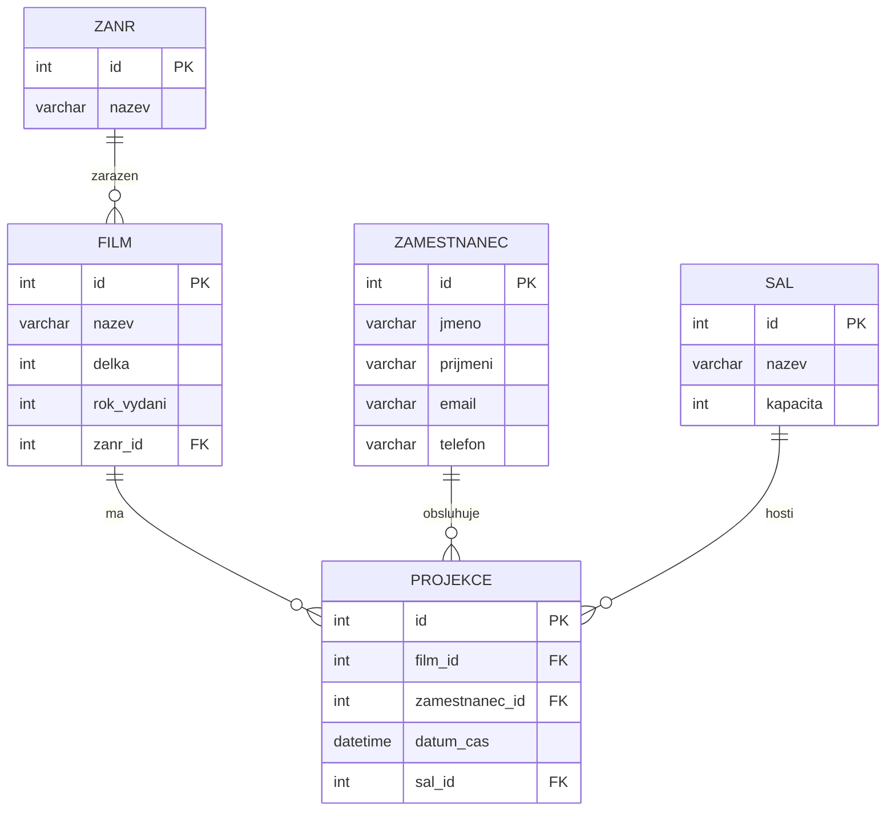
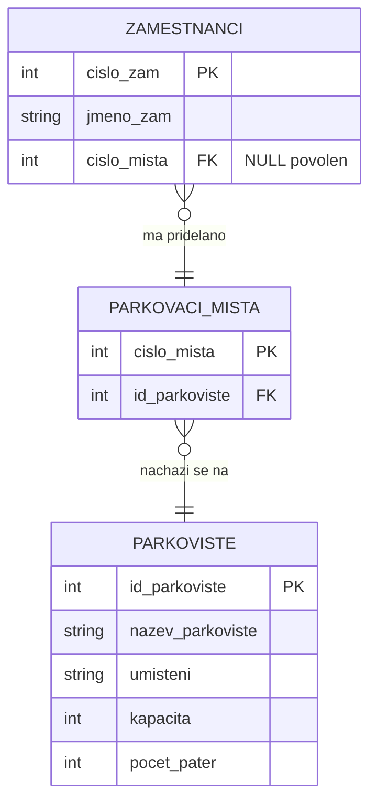

**1. K čemu je určen jazyk SQL a jak se rozděluje? Vysvětlete kompletní příkaz SELECT, včetně všech klauzulí, a podrobně je popište.**

SQL (Structured Query Language) je se používá pro vytvoření požadavků do relační databáze.
Rozděluje se do:
- DDL (data definition language) = create, alter, drop
- DML (data manipulation language) = select, insert, update, delete

kompletní SELECT příkaz:
```sql
SELECT [DISTINCT] sloupec1, sloupec2 [AS alias], ... agregacni_fce(sloupec)
FROM tabulka [AS alias]
[[LEFT/RIGHT/INNER/OUTER] JOIN tabulka2 [alias] ON podmínka ... dalsi joiny]
WHERE podminka
GROUP BY sloupec1, sloupec2...
HAVING podminka_na_agregaci  !!!!
ORDER BY sloupec1 [asc/desc], sloupec2...
```

- DISTINCT - odstraňuje duplikátní řádky
- FROM - určuje zdrojovou tabulku
- AS alias - přejmenuje sloupec ve výsledné tabulce
- JOIN - propojí data různých tabulek dle podmínky, typ joinu určuje, které řádky zůstavají 
- WHERE - filtruje záznamy před agregací, nemůže používat agr. fce
- GROUP BY - seskupuje řádky do skupin pro agregační fce (např. součet, průměr...)
- HAVING - filter skupin které vznikly z GROUP BY, může používat agr. fce
- ORDER BY - seřazení řádků podle zadaných sloupců. pokud sloupec1 je shodný, dále řadí podle sloupec2 atd.


**2. Databázové systémy (DBS) – Jaká architektura se v současnosti používá u databázových systémů a jaké požadavky by měla splňovat? Kde jsou uložená data a jak je k ním umožněn přístup?**

Klient-Server.
1. Klient - cokoliv co posílá požadavky na server, např. MSSQL management studio
2. DB Managment Server - Vyřizuje požadavky, vrací výsledky
3. Veškerá data zůstávají na straně serveru
4. Klient nikdy nemá přímý přístup k datům

![[klient-server2.png]]

**3. Vytvořte logický (ER) model pro filmovou společnost, která se zabývá projekcí filmů. Pro potřeby evidence ukládá data o zaměstnancích, filmech, projekcích atd. Dále vytvořte následující dotazy:**

a) **Datum nejstarší projekce v evidenci.**
b) **Počet filmů v evidenci pro jednotlivé žánry.**
c) **Filmy, které nebyly dosud promítány, střídané podle žánru a názvu filmu.**

Zde je návrh logického ER diagramu v Mermaid syntaxi (bez diakritiky) a SQL dotazy:

---

## ER Diagram (3NF)

![[mermaid_prakticky_priklad.svg]]
---

## SQL Dotazy

### a) Datum nejstarší projekce
```sql
SELECT MIN(datum_cas) AS nejstarsi_projekce
FROM PROJEKCE;
```

### b) Počet filmů dle žánrů
```sql
SELECT z.nazev AS zanr, COUNT(f.id) AS pocet_filmu
FROM ZANR z
LEFT JOIN FILM f ON z.id = f.zanr_id
GROUP BY z.id, z.nazev;
```

### c) Nepromítané filmy seřazené dle žánru a názvu
```sql
SELECT f.nazev, z.nazev AS zanr
FROM FILM f
JOIN ZANR z ON f.zanr_id = z.id
LEFT JOIN PROJEKCE p ON f.id = p.film_id
WHERE p.id IS NULL
ORDER BY z.nazev, f.nazev;
```

---


**4. Vysvětlete pojem integrita databáze. Popište a vysvětlete referenční integritni omezeni a uveďte jednoduchý příklad.**

**Integrita DB** = jednoznačnost, konzistence, spolehlivost DB

**Entitní** Integrita 
- Každá entita musí mít právě 1 atribut unikátní, není null, a jednoznačně označuje každý záznam v tabulce. => PK

**Referenční** Integrita
- **každý FK v jedné tabulce musí **odpovídat existujícímu PK v jiné tabulce, nebo být **NULL** (pokud je to povoleno).
- Pokud je nastavená ref. integrita, tak defaultně nelze smazat záznam ze strany 1, pokud odkazuje na záznam na straně N (lze to povolit pomocí např. ON DELETE CASCADE)


**Referenční integrita** je pravidlo v relačních databázích, které zajišťuje správné a logické vazby mezi tabulkami.  
Znamená to, že **každý cizí klíč (foreign key)** v jedné tabulce musí **odpovídat existujícímu primárnímu klíči (primary key)** v jiné tabulce, nebo být **NULL** (pokud je to povoleno).

### Smysl:

Zabraňuje tomu, aby DB obsahovala „**syrotky**“ záznamy – tedy odkazy na neexistující data.  
Například: nelze vytvořit objednávku pro zákazníka, který v tabulce zákazníků neexistuje.

### Příklad:

Máme dvě tabulky:

**Zákazníci**

|ID_zákazníka|Jméno|
|---|---|
|1|Novák|
|2|Svoboda|

**Objednávky**

| ID_objednávky | ID_zákazníka | Produkt |
| ------------- | ------------ | ------- |
| 101           | 1            | Chléb   |
| 102           | 2            | Mléko   |

Zde **ID_zákazníka** v tabulce _Objednávky_ je **cizí klíč**, který odkazuje na **primární klíč ID_zákazníka** v tabulce _Zákazníci_.

➡️ Pokud by se někdo pokusil vložit objednávku s `ID_zákazníka = 3`, databáze by to odmítla, protože zákazník s ID 3 neexistuje – tím se udržuje **referenční integrita**.

**Doménová** Integrita
- Omezení neklíčových atributů:
	- Datový typ
	- Rozsah    
	- Not Null
	- Unique
	- Check


**5. Proč provádíme normalizaci databáze? Co to znamená, že je databáze v 1. normální formě (1NF)?**

- Pro odstranění redundancí, nekonzistenci dat. 
- Cílem je usnadnit údržbu a zabránit nevyžádaných situací při práce s daty

### Definice normálních forem:
- **1. NF**: Atomické hodnoty + primární klíč, každý záznam je jedinečný
- **2. NF**: Plná závislost na celém PK (řeší složené klíče)
- **3. NF**: Eliminace tranzitivních závislostí


Normalizujte následující tabulku tak, aby výsledná databáze splňovala 1. až 3. normální formu (3NF). Nakreslete nové relační schéma se všemi potřebnými tabulkami, včetně klíčů, atributů a omezeními.

*Popis tabulky: Organizace má několik parkovišť, které používají zaměstnanci. Tabulka ukazuje zaměstnance, kterým bylo přiděleno parkovací místo. Každé parkovací místo je jedinečně identifikováno pomocí čísla parkovacího místa.*

| číslo_zam | jmeno_zam        | parkovište | umístění | kapacita | pocet_pater | číslo_mista |
| --------- | ---------------- | ---------- | -------- | -------- | ----------- | ----------- |
| 1156      | Jane Jones       | Yellow     | Blok A   | 120      | 3           | 123         |
| 2311      | Karen Gilmore    | Yellow     | Blok B   | 120      | 3           | 145         |
| 1167      | Richard Bilgitt  | Yellow     | Blok B   | 120      | 3           | 156         |
| 2345      | Guy Ritchie      | Green      | Blok D   | 45       | 2           | 26          |
| 3434      | Stephen Williams | Green      | Blok D   | 45       | 2           | 34          |


3-NF: **!!! NEVIM JESTLI JE TO SPRAVNE** 



![[normal.png]]

**6. Pro dané tři tabulky sestavte příkaz SQL, který vypíše dopravní společnosti, které mají na své trase vozy Mercedes. Vepište společnost, zemi a celkový počet vozů

**Dopravní_vůz** (id, vyrobce, typ_vozu, najeto_km, kapacita, vozidlo_v_provozu_od)
**Dopravní_společnost** (id, nazev, zeme, svetadil, zalozeno)
**Trasa** (id, společnost_id, vuz_id, pocet_vozu)

```sql
SELECT
  ds.nazev AS spolecnost,
  ds.zeme,
  COUNT(dv.id) AS pocet_vozu
FROM
  trasa t
  INNER JOIN dopravni_vuz dv ON t.vuz_id = dv.id
  INNER JOIN dopravni_spolecnost ds ON t.spolecnost_id = ds.id
WHERE
  dv.vyrobce = 'Mercedes-Benz'
GROUP BY
  ds.nazev,
  ds.zeme;
```


