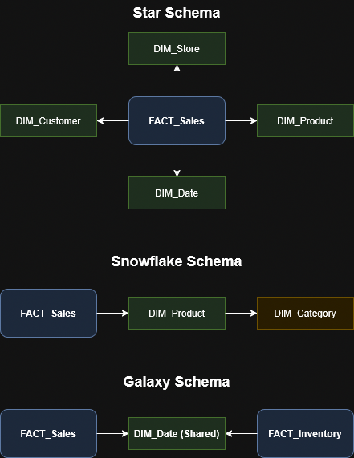

## 1. Architektura MySQL

### Jaká je logická struktura MySQL a co dělají jednotlivé bloky?

* **Klient:** Aplikace, pomocí které se uživatel připojuje k serveru.

* **Server:** Databázová instance, kde jsou uložena data.

* **mysqld (daemon):** Vícevláknový proces běžící na pozadí, který spravuje příchozí a odchozí požadavky. Přiděluje každému připojení unikátní thread_id, přičemž toto připojení (session) trvá od propojení až do jeho ukončení.

* **Parser (analyzátor):** Kontroluje syntaxi SQL příkazů, ověřuje uživatelská oprávnění a automaticky generuje pro příkazy jedinečné sql_id.

* **Optimizer:** Připravuje prováděcí plán (execution plan) pro přístup na disk a pracuje multisessionově s příkazy různých připojení.

* **Metadata cache:** Paměť vyhrazená pro metadata, jako jsou názvy tabulek, procedur, uživatelská práva a statistiky.

* **Query Cache:** Paměť uchovávající předchozí analyzované příkazy. Zkracuje čas zpracování tím, že funguje jako předpřipravená data, pokud se najde shoda pro příchozí požadavek.

* **Key Cache:** Paměť určená pro indexy. U velkých indexů uchovává pouze B-strom, zatímco samotná data zůstávají na disku.

### Jak vypadá fyzická struktura a co obsahují hlavní adresáře?

* **MySQL base directory:** Zahrnuje programové soubory, knihovny a spustitelné soubory jako `mysql`, `mysqld`, `mysqladmin` nebo `mysqldump`.

* **MySQL data directory:** Obsahuje systémová data jako server log file, status file, .ib log files a system tablespace. Dále se zde nachází podadresáře jednotlivých databází s uloženými indexy, daty a strukturami objektů ve formátu .frm.

* Co je to FACT, DIM?

- FACT =~ činnost
- DIM = číselníky

### Co je to systémový katalog?

* Systémový katalog udržuje logickou strukturu objektů a metadata databázového schématu.

---

## 2. Data Pipeline

### Co jsou OLTP a OLAP, jaký je mezi nimi rozdíl a význam?

* **OLTP (Online Transaction Processing):** Systém nasazený nad plně normalizovanou databází, který je optimalizovaný pro velké množství rychlých transakcí (INSERT, UPDATE, DELETE) v běžném provozu.

* **OLAP (Online Analytical Processing):** Systém pro efektivní získávání a čtení dat z datového skladu pro účely pokročilých analýz.

* **Rozdíl:** OLTP slouží k zajištění operativního chodu bez datových redundancí, naproti tomu OLAP cíleně pracuje s denormalizovanými daty (tabulky FACT a DIM) pro urychlení reportingu.

### Jak fungují procesy ETL/ELT a proč se provádí čištění dat?

* **Definice procesů:** Slouží k přechodu dat z normalizované OLTP databáze do analytického OLAP skladu. Zkratky určují pořadí operací - Extract, Transform, Load (ETL) nebo Extract, Load, Transform (ELT).

* **Čištění dat:** Provádí se například kvůli chybějícím údajům. Nelze si vymýšlet povinné údaje, pokud tedy data přijdou nekompletní, musí se poslat zpět s chybovou hláškou.

* V rámci procesů a tvorby DIM tabulek se místo původních primárních klíčů definují jedinečné Surrogate Keys (SKs) a využívají se i Natural Keys (NKs) jako reálná identifikační čísla.

---

## 3. Datový sklad (DWH)

### Jaký je rozdíl mezi DWH a normalizovanou databází a proč se DWH používá?

* **Rozdíl:** DWH představuje centrální úložiště stavěné primárně pro reporting a analýzy, zatímco běžná normalizovaná databáze je určena k zajištění plynulého provozu.

* **Důvod použití:** DWH využívá strukturu jedné faktové tabulky a více dimenzních tabulek pro OLAP procesy k rychlému čtení rozsáhlých objemů informací.

### Jaké jsou typy DWH schémat a jak se liší?

* **Star Schema (Hvězda):** Obsahuje centrální FACT tabulku a denormalizované DIM tabulky. Je strukturálně nejjednodušší a zajišťuje nejrychlejší dotazování.

* **Snowflake Schema (Vločka):** Její DIM tabulky jsou normalizované, tedy rozvětvené. Odstraňuje se tím sice redundance dat, ale vede to ke složitějším dotazům s více spojeními (JOINy) a ke zpomalení výkonu.

* **Galaxy Schema (Galaxie):** Zahrnuje více různých FACT tabulek, které navzájem sdílejí stejné DIM tabulky (tzv. Conformed Dimensions). Je vhodná ke sledování více procesů najednou.

---

## 4. Vizualizace dat

### Jaký je princip, důvod a tvorba vizualizace dat?

* **Princip:** Grafické zobrazení informací a dat prostřednictvím vizuálních prvků jako jsou mapy nebo grafy.

* **Důvod:** Slouží k transformaci abstraktních dat do pochopitelné podoby neboli storytellingu pro sledování trendů a vzorů. Umožňuje efektivní rozhodování na základě faktů a odhalování klíčových indikátorů výkonnosti.

* **Tvorba a modely:** Datové modely fyzicky zobrazují fact a dim tabulky a tvorbu spojení (vazeb) mezi nimi. Samotná tvorba vizualizací pak probíhá rozmisťováním grafů na dashboardu.

### Jaká je hlavní funkcionalita v Power BI a možnosti importu?

* **Model View:** Pohled sloužící k prohlížení tabulek a vytváření vazeb.

* **Power Query:** Nástroj umožňující editaci a transformaci tabulek v rámci ELT procesu.

* **Dashboard:** Plátno pro vizualizaci výsledků.

* **DAX:** Jazyk pro měření a pokročilé výpočty.

* **Import dat:** * **Import:** Fyzické nahrání celých dat do paměti aplikace, například z formátu CSV.

* **Direct Query:** Živé připojení (Live connection) směřující rovnou ke cloudovému nebo serverovému zdroji.

---

## 5. Zálohování a archivace

### Jaký je rozdíl mezi archivací a zálohou dat?

* **Archivace:** Uchovává data dlouhodobě (10 a více let) v jednoduchých formátech typu CSV nebo JSON z důvodů historie a auditů. Předpokládá se velmi málo častý přístup k souborům.

* **Záloha:** Znamená pravidelné uložení dat v plném formátu na krátkou dobu na aktivní server. Slouží k velmi rychlé obnově a archivní soubory k ní nelze použít, protože neobsahují systémové soubory.

### Jaké existují typy záloh a k čemu slouží obnova?

* **Typy záloh:** Zálohovat je možné celou databázi, vybranou část databáze, transakční logy, jednotlivé soubory nebo pouze samotné změny v datech.

* **Obnova dat:** Slouží primárně k záchraně dat po výpadku systému, poškození disku nebo chybách uživatele (např. po smazání tabulky). Zálohy se používají také pro přesun dat mezi servery, úsporu místa nebo pro účetní audity.

* **Transakční log:**

### Jaký je rozdíl mezi MSSQL a MySQL zálohováním?

* V poznámkách je uvedeno pouze to, že systém MySQL používá pro export dat zabudovaný nástroj `mysqldump`. 
* = každá tabulka do zvláštního souboru, možná částečná obnova
* Jinak MySQL nemá zálohování, dělá se export.
* není to záloha, data se dají číst přímo ze zálohy, neproběhne serializace 

