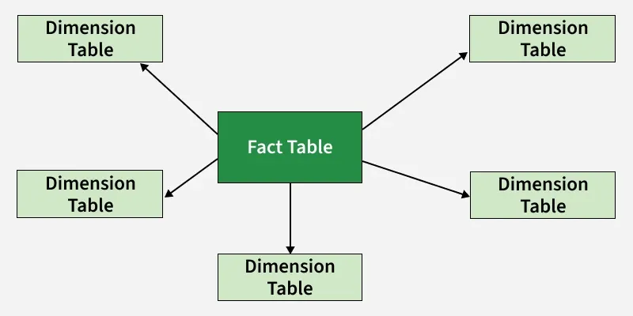
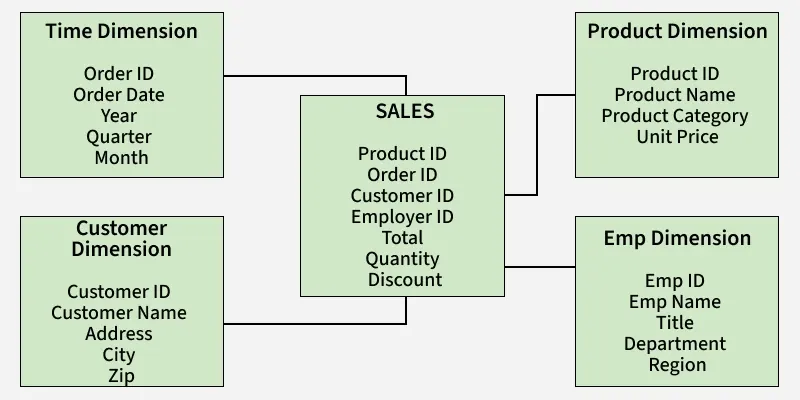
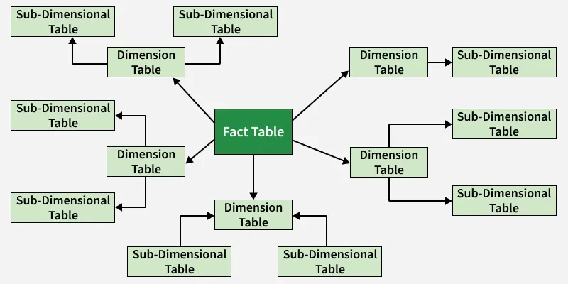
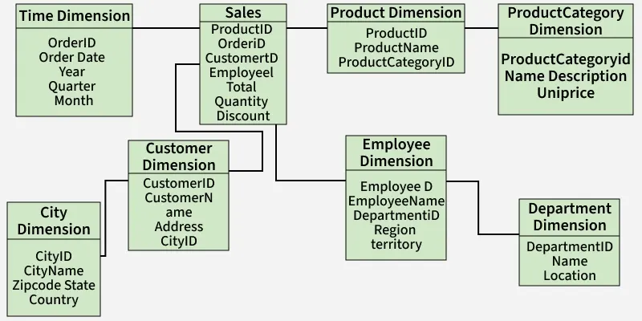
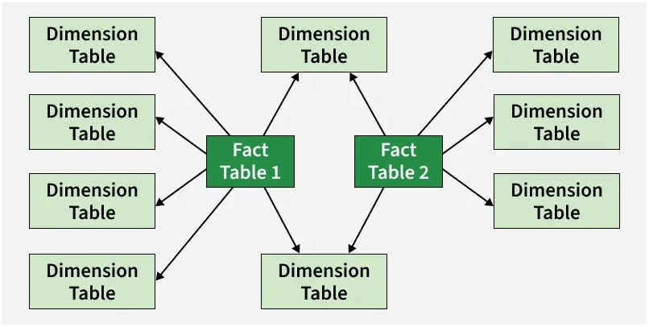
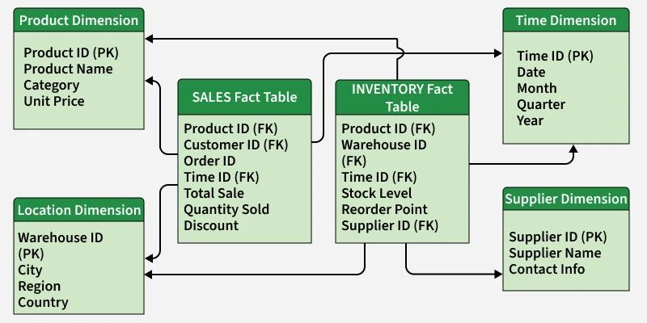
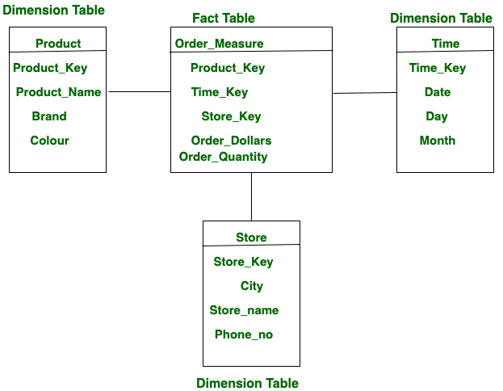
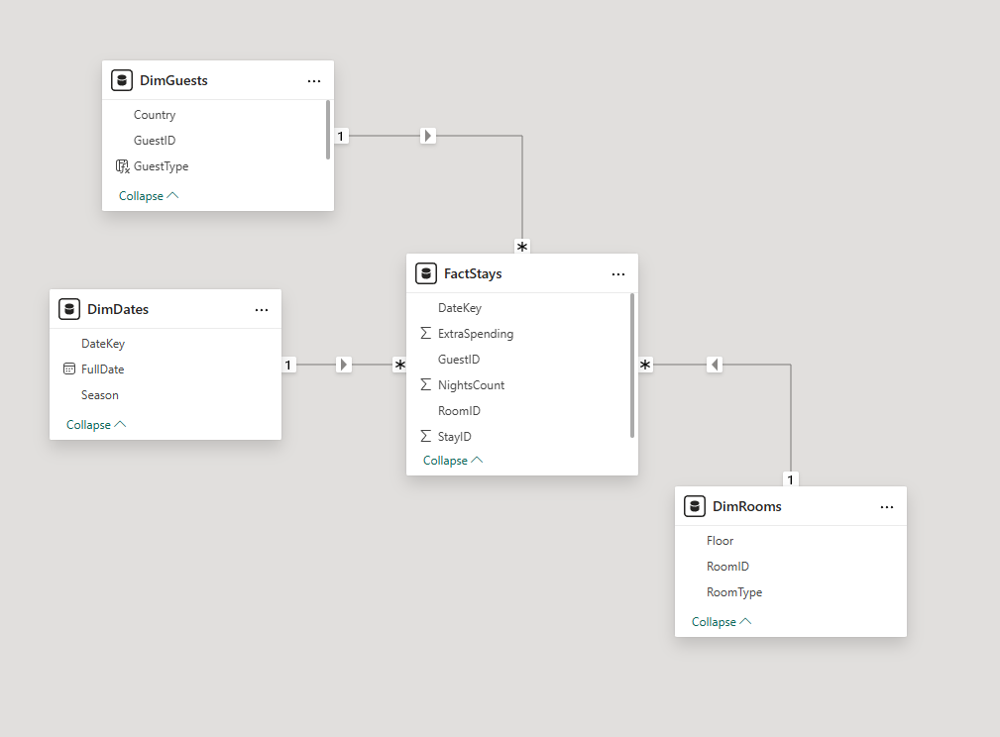
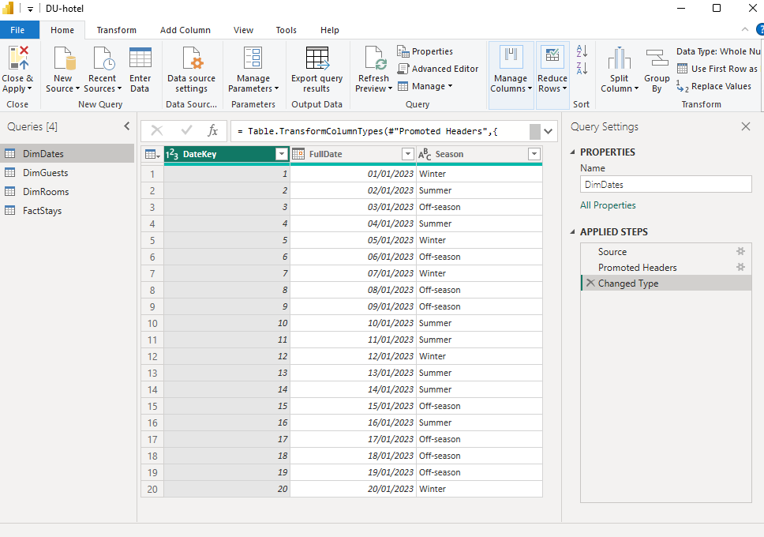
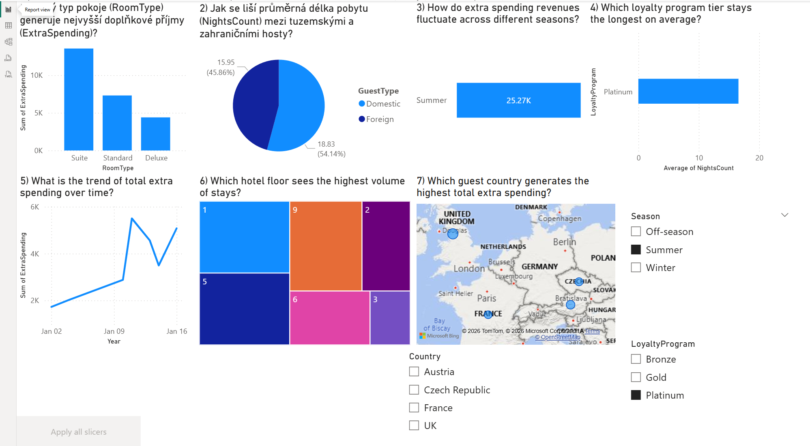

# Test A

## 1. Architektura MySQL

* Popište **logickou strukturu** MySQL (jednotlivé bloky).
* Vysvětlete, jak probíhá **zpracování dotazu**.
* Co je to **Storage Engine** a jaký je hlavní rozdíl mezi **InnoDB** a **MyISAM**?

## 2. Data Pipeline & DWH

* Vysvětlete rozdíl mezi systémy **OLTP a OLAP** a uveďte příklad použití pro každý z nich.
* Jaký je rozdíl mezi **ETL a ELT** procesy? Stručně popište jednotlivé fáze.
* Vysvětlete pojem **Surrogate Keys** (náhradní klíče) a proč se používají v DWH.

## 3. Zálohování a archivace

* Vysvětlete rozdíl mezi **zálohou (backup)** a **archivací dat** (uveďte příklad pro obojí).
* Jaké základní **typy záloh** znáte a jaký je význam **transakčního logu**.
* Popište proces **obnovy dat (recovery)** – co je jeho cílem?

## 4. Vizualizace a Power BI

* Popište hlavní komponenty **Power BI Desktop**.
* Co jsou **relace** v datovém modelu a proč jsou nezbytné pro správnou vizualizaci?
* K čemu se v Power BI používá jazyk **DAX**?
* Vyjmenujte 3 základní **typy grafů** a uveďte, pro jaký účel se hodí.

---

# Test B

## 1. Architektura MySQL

### 1.1 Popište fyzickou strukturu MySQL (význam datového adresáře a typy souborů).

Fyzická struktura MySQL se skládá ze dvou hlavních částí:

**1. Základní adresář (Base directory)**
Obsahuje systémové knihovny a **hlavní spustitelné programy**.
* **mysqld:** Hlavní proces serveru běžící na pozadí.
* **mysql:** Klientská aplikace.
* Pomocné nástroje: mysqladmin a mysqldump.

**2. Datový adresář (Data directory)**
Zajišťuje **ukládání skutečných dat a chod serveru**.
* **Systémová data:** Obsahují globální soubory pro správu, jako jsou **logy serveru, transakční logy a systémový tablespace**.
* **Datové podadresáře:** Každá databáze má vlastní složku, která ukrývá její **samotná data, indexy a definiční soubory struktury (.frm)**.

### 1.2 Jak MySQL pracuje s pamětí a proč je tato komponenta zásadní pro výkon?

**MySQL využívá paměť primárně k minimalizaci pomalých operací na fyzickém disku.**
Paměť se dělí do dvou hlavních úrovní:
	
**1. Cache (Mezipaměť na úrovni serveru)**
Uchovává menší informace pro rychlou přípravu dotazů.
* **Query Cache:** Ukládá **již provedené a zkontrolované SQL dotazy**.	
* **Metadata Cache:** Uchovává **definice struktury databáze** (tabulky, práva), nikoliv uživatelská data.
* **Key Cache:** Ukládá **indexy** k právě zpracovávaným tabulkám.
	    
**2. Buffer (Vyrovnávací paměť na úrovni Storage Engines)**
Obsluhuje přímou komunikaci s fyzickým diskem.
* Načítá a uchovává **větší objemy skutečných datových bloků**.
* Umožňuje (například u jádra InnoDB) **efektivní a rychlé transakční zpracování (ACID)**.
* Je **kapacitně větší, ale mírně pomalejší** než cache.

**Proč je paměť zásadní pro výkon?**
* Výkon databáze je limitován rychlostí přístupu k datům, přičemž **čtení z disku je nejpomalejší operací**.
* Optimalizátor se proto snaží **minimalizovat přístupy na disk** při sestavování prováděcího plánu.
* Ukládání dotazů, struktury a indexů do rychlé paměti **drasticky snižuje zátěž disku a šetří procesorový čas**.
* Výsledkem je **mnohonásobně rychlejší odbavování požadavků klientů**.

### 1.3 K čemu slouží Systémový katalog z pohledu administrátora a jaká metadata obsahuje?

**Systémový katalog je centrální informační registr o celé databázi.** Fyzicky je uložen v datových podadresářích spolu s daty a indexy.
Je nezbytný pro **správu, údržbu a zabezpečení**. Databázový systém z něj získává informace pro **kontrolu syntaxe, ověřování práv a tvorbu prováděcích plánů**.

Katalog slouží jako **úložiště metadat (definice a data o datech)**, neobsahuje uživatelská data. Konkrétně uchovává:
* **Definice struktury objektů:** Názvy tabulek, vlastnosti sloupců a celkové schéma.
* **Integritní omezení:** Pravidla pro konzistenci a správnost dat (primární a cizí klíče).
* **Programové objekty:** Definice uložených procedur a podobných objektů.
* **Bezpečnostní nastavení:** Uživatelské účty, role a přístupová práva.
* **Statistiky o objektech:** Informace pro optimalizaci a efektivní zpracování dotazů.

Pro zrychlení systému se často využívaná metadata **načítají přímo do operační paměti do Metadata Cache**, aby se předešlo pomalému vyhledávání na pevném disku.

## 2. Datové sklady (DWH)

### 2.1 Definujte datový sklad (DWH), popište jeho typickou strukturu a hlavní důvod použití.

**Definice datového skladu (DWH)**
Datový sklad (z anglického *Data Warehouse*) je centrální úložiště dat, která jsou shromažďována z jednoho nebo vícero nezávislých zdrojů. Je primárně **optimalizovaný pro potřeby analýzy, reportingu a business intelligence** a na rozdíl od běžných provozních databází slouží pro analytické procesy typu OLAP (Online Analytical Processing).

**Typická struktura**
Struktura datového skladu se liší od běžných plně normalizovaných databází. Zpravidla je organizována do specifických schémat, přičemž nejzákladnějším je **Star Schema (Hvězda)**. Dalšími variantami jsou *Snowflake Schema* (Vločka) nebo *Galaxy Schema* (Galaxie). 

Základní struktura se skládá ze dvou hlavních typů tabulek:
* **Faktové tabulky (FACT):** Tvoří střed schématu a obsahují měřitelné, kvantitativní údaje (např. tržby, náklady, délka pobytu) a klíče, které odkazují na tabulky dimenzí.
* **Dimenzní tabulky (DIM):** Obklopují faktovou tabulku a obsahují popisné údaje a číselníky (odpovídají na otázky "kdo, co, kde, kdy"). V nejběžnějším schématu hvězdy jsou dimenze **denormalizované**, což znamená, že záměrně obsahují redundantní (opakující se) data, aby se urychlilo vyhledávání. 

**Hlavní důvod použití**
Získávat komplexní byznysové informace a statistiky přímo z běžné provozní databáze (OLTP) je výkonnostně velmi náročné a pomalé, protože plně normalizovaná struktura vyžaduje pro získání výsledku spojování velkého množství tabulek (pomocí operací JOIN) a složité agregace. 

Hlavním důvodem nasazení DWH je tedy **rychlé a efektivní čtení rozsáhlých historických dat pro tvorbu přehledů a statistik**. V datovém skladu se data předem transformují a spojují (pomocí procesů ETL/ELT), čímž se radikálně snižuje nutnost spojování tabulek při samotném dotazování a analytické dotazy nad jedinou faktovou tabulkou jsou tak mnohonásobně rychlejší.

### 2.2 Vysvětlete, proč se do vizualizací obvykle nepřenášejí data přímo z provozních (OLTP) databází.

#### Proč se OLTP data nevizualizují přímo
* **OLTP databáze jsou navrženy pro rychlé transakce a zápisy**, nikoliv pro hromadné čtení.
* Z důvodu prevence redundance jsou **data vysoce normalizovaná a roztříštěná do mnoha tabulek**.
* Analytika přímo nad OLTP znamená **neúnosnou výkonnostní zátěž a pomalé dotazy**, protože databáze musí v reálném čase provádět složité agregace a spojování tabulek.

#### Standardní řešení
* Data se přesouvají do **datových skladů (DWH) nebo systémů OLAP**.
* Zde probíhá **denormalizace dat (jejich cílené sloučení do menšího počtu tabulek a předpočítání hodnot)**.
* Výsledkem je **výrazné zrychlení a zjednodušení analytických dotazů i vizualizací**.

### 2.3 Popište rozdíl mezi architekturou Star Schema (hvězda) a Snowflake (vločka).

#### Star Schema (Hvězda)
* **Charakteristika**: Nejjednodušší struktura s **přímým napojením dimenzí** na centrální faktovou tabulku.
* **Data**: Využívá **denormalizaci**, což znamená, že obsahuje redundantní (opakující se) data pro vyšší rychlost.
* **Výhody**: Nabízí **nejvyšší výkon při dotazování** a jednoduchost díky minimu spojování (JOIN) tabulek.

#### Snowflake Schema (Vločka)
* **Charakteristika**: Varianta hvězdy, kde se **dimenze dále větví** do podtabulek.
* **Data**: Využívá **normalizaci**, která odstraňuje duplicitu dat a šetří místo, ale zvyšuje strukturální složitost.
* **Nevýhody**: Vyžaduje **vícenásobné spojování tabulek (JOIN)**, což může vést ke **zpomalení výkonu** u rozsáhlých analýz.

### 2.4 Vysvětlete, co je to faktová tabulka a dimenze.

#### Faktová tabulka (FACT)
* Obsahuje **ústřední měřitelné metriky a číselné údaje** (např. cena, počet, zisk).
* Skládá se z **cizích klíčů odkazujících na dimenze** a samotných faktů.
* Představuje konkrétní událost nebo proces (např. prodej, adopce).

#### Dimenze (DIM)
* Poskytují **kontext k faktům** a obsahují **popisné atributy** (odpovídají na „kdo, co, kde, kdy“).
* Slouží jako číselníky pro filtrování a seskupování dat.
* V **Star Schema jsou denormalizované** (rychlost), v **Snowflake Schema jsou normalizované** (úspora místa).

## 3. Zálohování a archivace

### 3.1 Proč používáme archivaci dat a jaké typy souborových formátů jsou pro ni vhodné?

Archivace slouží k **dlouhodobému ukládání historických dat** (10+ let) pro účely **zpětného auditu** nebo **analýzy trendů**. Data jsou uložena na zabezpečeném serveru s předpokladem **nízké frekvence přístupu**.

Pro archivaci jsou ideální **jednoduché souborové formáty** a standardizované kódování:

* **CSV, SQL, JSON**
* **UTF-8** (případně Windows-1250)

### 3.2 Co je to diferenciální záloha a v čem je její výhoda oproti plné záloze?

#### Diferenciální záloha
**Diferenciální záloha** zálohuje pouze data změněná nebo přidaná **od poslední plné zálohy**.

#### Výhody oproti plné záloze
* **Šetří místo na disku**: Neukládá se znovu celý objem dat, pouze přírůstky.
* **Vyšší rychlost**: Proces zálohování trvá kratší dobu.
* **Efektivní obnova**: K obnově dat stačí pouze **poslední plná záloha a nejaktuálnější diferenciální záloha**.

### 3.3 K čemu se v databázi používá transakční log při výpadku systému?

Transakční log (Write-Ahead Log) je soubor, který obsahuje provedené příkazy, slouží k **zajištění integrity dat** po výpadku systému pomocí dvou mechanismů:
* **Redo (Znovudokončení):** Systém znovu aplikuje změny z **potvrzených transakcí (COMMIT)**, které se před pádem nestihly zapsat z paměti na disk.
* **Undo (Vracení zpět):** Systém **odstraní změny z neukončených transakcí**, které v momentě výpadku nebyly potvrzeny, a vrátí databázi do konzistentního stavu.

## 4. Vizualizace a Power BI

### 4.1 Popište hlavní funkcionalitu Power BI.

Power BI slouží k **transformaci dat do srozumitelné formy (storytelling)** pro efektivní rozhodování založené na faktech a identifikaci **klíčových indikátorů výkonnosti (KPI)**.

* **Model View:** Slouží k zobrazení **dimenzních (DIM) a faktových (FACT) tabulek** a k nastavení **vazeb (JOINů)** mezi nimi. Funguje na principu klasického **ER modelu**.

* **Power Query:** Modul určený pro **přímou editaci tabulek a čištění dat** v rámci procesu ELT/ETL.

* **DAX (Data Analysis Expressions):** Specializovaný jazyk pro tvorbu **pokročilých výpočtů a měření** v datových modelech.
* **Import dat:** Podporuje buď **klasický import** (např. nahrání CSV), nebo **Direct Query (Live connection)** pro přímé živé napojení na cloudové servery.
* **Dashboard:** Finální nástroj pro **vizualizaci dat** (grafy, mapy, tabulky), který pomáhá odhalovat trendy a vzory.

### 4.2 Popište proces čištění dat (Power Query) a uveďte 3 příklady transformací.

Hlavním účelem je **transformovat surová data do čisté, strukturované a normalizované podoby** pro analýzu.

* **Rozdělení dat a odstranění znaků:** Očištění dat a tvorba normalizovaných tabulek (např. rozdělení jedné tabulky na samostatné tabulky "autorů" a "knih").
* **Výpočet nových (kalkulovaných) atributů:** Vytváření nových údajů z původních dat (např. výpočet zisku nebo délky pobytu).
* **Zpracování chybějících hodnot:** Ošetření chyb v datech – při absenci povinných údajů se **data vrací zpět do zdroje s chybovou hláškou** (systém si nesmí data vymýšlet).

### 4.3 Uveďte 3 základní typy vizualizací a vysvětlete, jaký typ dat/analýzy na nich zobrazujeme.

* **Karta (Card)**: Zobrazuje **jedinou klíčovou hodnotu** (např. celkové tržby). Slouží pro okamžitý přehled o **hlavních ukazatelích výkonnosti (KPI)**.
* **Průřez (Slicer)**: Funguje jako **interaktivní filtr** přímo na ploše reportu. Umožňuje **dynamicky omezit data** podle dimenzí, jako je čas nebo kategorie.
* **Koláčový graf (Pie chart)**: Zobrazuje **procentuální podíl částí na celku**. Je vhodný pro vizualizaci **struktury a rozložení dat** u menšího počtu kategorií.
* **Sloupcový graf (Column chart)**: Slouží k **porovnání hodnot napříč různými kategoriemi**. Je ideální pro zobrazení **změn v čase** (např. tržby po měsících) nebo pro **srovnání velikosti** jednotlivých položek mezi sebou.